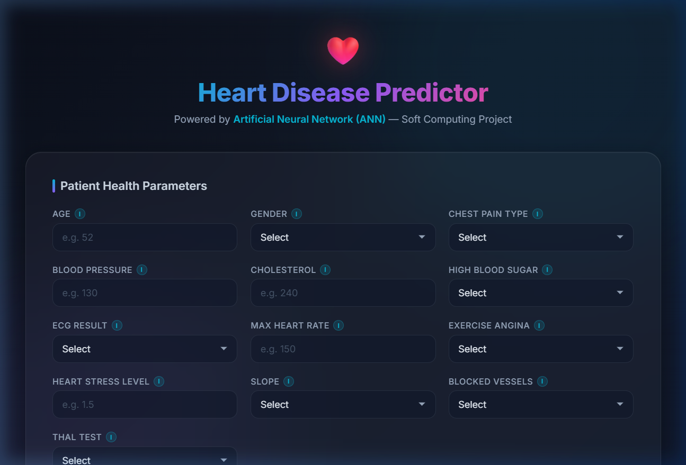
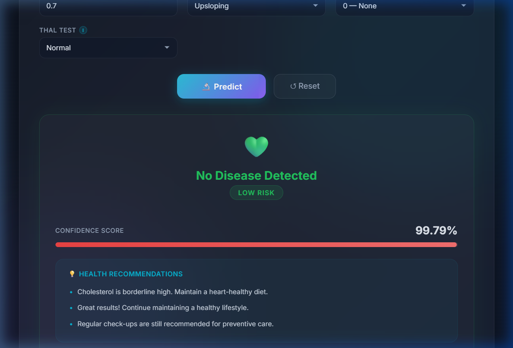
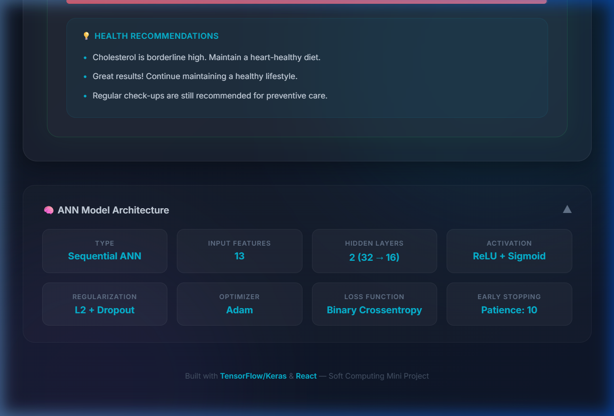

# ❤️ Heart Disease Predictor — ANN Based

> A full-stack web application that predicts the likelihood of heart disease using an **Artificial Neural Network (ANN)** built with TensorFlow/Keras. Developed as a **Soft Computing Mini Project**.



---

## 🔍 About the Project

Heart disease is one of the leading causes of death worldwide. Early detection can save lives. This project uses a trained **ANN model** on the **Cleveland Heart Disease Dataset** to predict whether a patient is at risk, based on 13 clinical parameters.

The application features:
- A **React** frontend with a modern glassmorphism dark-themed UI
- A **Flask** backend serving predictions via REST API
- An **ANN model** trained with TensorFlow/Keras

---

## 📸 Screenshots

### 🏠 Main Form — Patient Health Parameters


### 📊 Prediction Result — Confidence Score & Health Tips


### 🧠 ANN Model Architecture Info


---

## 🧠 ANN Model Architecture

| Component | Details |
|-----------|---------|
| **Type** | Sequential (Feedforward ANN) |
| **Input Layer** | 13 features |
| **Hidden Layer 1** | Dense(32, ReLU) + L2 Regularization + Dropout(0.3) |
| **Hidden Layer 2** | Dense(16, ReLU) + L2 Regularization + Dropout(0.2) |
| **Output Layer** | Dense(1, Sigmoid) — Binary Classification |
| **Optimizer** | Adam |
| **Loss Function** | Binary Crossentropy |
| **Early Stopping** | Patience = 10, restores best weights |
| **Scaler** | StandardScaler (fitted on training data) |

### Model Training Flow

```
Input (13 features) → Dense(32, ReLU) → Dropout(0.3) → Dense(16, ReLU) → Dropout(0.2) → Dense(1, Sigmoid) → Output
```

---

## 📋 Input Features (13 Parameters)

| # | Feature | Description | Type |
|---|---------|-------------|------|
| 1 | **Age** | Patient's age in years | Numeric |
| 2 | **Sex** | Gender (1 = Male, 0 = Female) | Categorical |
| 3 | **Chest Pain Type (cp)** | 0 = No Pain, 1 = Mild, 2 = Moderate, 3 = Severe | Categorical |
| 4 | **Resting Blood Pressure (trestbps)** | In mmHg (normal: 90–120) | Numeric |
| 5 | **Serum Cholesterol (chol)** | In mg/dL (normal: 150–200) | Numeric |
| 6 | **Fasting Blood Sugar (fbs)** | >120 mg/dL (1 = Yes, 0 = No) | Boolean |
| 7 | **Resting ECG (restecg)** | 0 = Normal, 1 = Minor, 2 = Abnormal | Categorical |
| 8 | **Max Heart Rate (thalach)** | Maximum heart rate during exercise | Numeric |
| 9 | **Exercise Angina (exang)** | Chest pain during exercise (1 = Yes, 0 = No) | Boolean |
| 10 | **ST Depression (oldpeak)** | Exercise-induced ST depression (0.0–6.2) | Numeric |
| 11 | **Slope** | ST segment slope (0 = Down, 1 = Flat, 2 = Up) | Categorical |
| 12 | **Major Vessels (ca)** | Number colored by fluoroscopy (0–3) | Numeric |
| 13 | **Thalassemia (thal)** | Stress test result (1 = Normal, 2 = Fixed, 3 = Reversible) | Categorical |

---

## ✨ Key Features

- 🎨 **Premium Dark UI** — Glassmorphism design with smooth animations
- 🔬 **Real-time Prediction** — Instant heart disease risk assessment
- 📊 **Confidence Score** — Visual gauge bar showing model confidence percentage
- 🏷️ **Risk Level Indicator** — Low / Medium / High risk classification
- 💡 **Personalized Health Tips** — Context-aware recommendations based on input values
- ℹ️ **Info Tooltips** — Medical context for each input field
- 🧠 **Model Architecture Viewer** — Expandable section showing ANN details
- 📱 **Responsive Design** — Works on desktop, tablet, and mobile
- ✅ **Inline Validation** — Visual feedback for invalid inputs

---

## 🛠️ Tech Stack

| Layer | Technology |
|-------|-----------|
| **Frontend** | React 19, Vanilla CSS (Glassmorphism) |
| **Backend** | Flask, Flask-CORS |
| **ML Model** | TensorFlow/Keras (Sequential ANN) |
| **Data Processing** | NumPy, Pandas, Scikit-learn (StandardScaler) |
| **Dataset** | Cleveland Heart Disease Dataset (1026 samples) |

---

## 🚀 Getting Started

### Prerequisites

- Python 3.10+
- Node.js 18+
- pip

### 1. Clone the Repository

```bash
git clone https://github.com/Rudra20-05/heart-disease-predictor.git
cd heart-disease-predictor
```

### 2. Setup Backend

```bash
cd backend
pip install flask flask-cors numpy pandas scikit-learn tensorflow joblib
python app.py
```

The Flask API will start at `http://localhost:5000`

### 3. Setup Frontend

```bash
cd frontend
npm install
npm start
```

The React app will open at `http://localhost:3000`

### 4. (Optional) Retrain the Model

```bash
cd backend
python model.py
```

This will retrain the ANN and save updated `model.h5` and `scaler.pkl` files.

---

## 📁 Project Structure

```
heart-disease-predictor/
├── backend/
│   ├── app.py              # Flask API server
│   ├── model.py            # ANN training script
│   ├── model.h5            # Trained Keras model
│   ├── scaler.pkl          # Fitted StandardScaler
│   ├── model.pkl           # Alternative model pickle
│   └── heart.csv           # Cleveland Heart Disease Dataset
├── frontend/
│   ├── public/
│   │   └── index.html
│   ├── src/
│   │   ├── App.js          # Main React component
│   │   ├── App.css         # Premium dark theme styles
│   │   ├── index.js        # React entry point
│   │   └── index.css       # Global styles & font imports
│   └── package.json
├── screenshots/
│   ├── main-form.png
│   ├── prediction-result.png
│   └── model-architecture.png
├── .gitignore
└── README.md
```

---

## 🔗 API Endpoints

| Method | Endpoint | Description |
|--------|----------|-------------|
| `GET` | `/` | Health check — returns "API Running" |
| `POST` | `/predict` | Predict heart disease from 13 features |
| `GET` | `/model-info` | Returns ANN model architecture details |

### POST `/predict` — Example Request

```json
{
  "features": [52, 1, 2, 130, 260, 0, 0, 150, 0, 1.5, 1, 0, 1]
}
```

### Response

```json
{
  "result": 1,
  "probability": 99.79,
  "message": "No Disease Detected",
  "risk_level": "Low",
  "tips": [
    "Cholesterol is borderline high. Maintain a heart-healthy diet.",
    "Great results! Continue maintaining a healthy lifestyle.",
    "Regular check-ups are still recommended for preventive care."
  ]
}
```

---

## 📚 Dataset

The **Cleveland Heart Disease Dataset** from the UCI Machine Learning Repository is used for training. It contains 1026 samples with 13 clinical features and a binary target (0 = Disease, 1 = No Disease).

**Source:** [UCI ML Repository — Heart Disease](https://archive.ics.uci.edu/ml/datasets/heart+Disease)

---

## 👨‍💻 Author

**Rudra Dalvi**  
Vidyalankar Institute of Technology  
Soft Computing Mini Project — 2026

---

## 📄 License

This project is for educational purposes as part of a university mini project.
